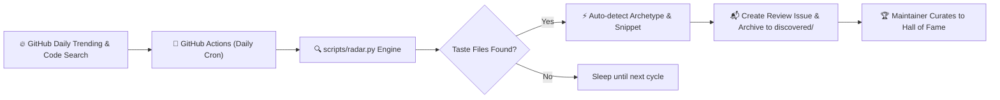
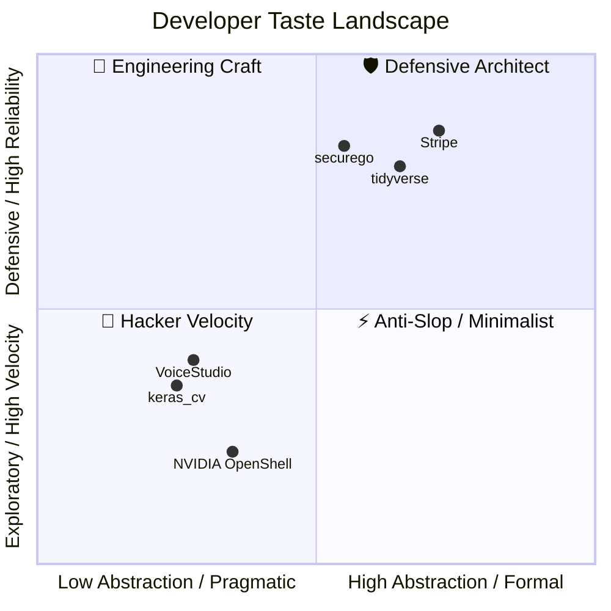

<div align="center">

# 🍷 Taste Your Taste
### *Curating Developer Taste & Vibe Stacking Engine for AI Agents*

**CLAUDE.md • .agent • .cursorrules • AGENTS.md • The Anti-Slop Philosophy**

<p align="center">
  <a href="https://github.com/joe1chief/taste-your-taste/actions/workflows/radar.yml">
    
  </a>
  <a href="https://github.com/joe1chief/taste-your-taste/stargazers">
    
  </a>
  <a href="./LICENSE">
    
  </a>
  <a href="https://github.com/joe1chief/taste-your-taste/pulls">
    
  </a>
  <a href="./README_CN.md">
    
  </a>
</p>

<p align="center">
  <b>"Code generation is cheap. Taste is rare."</b>
</p>

```bash
# Instant Vibe Stacking with npx:
npx taste-code blend --style antfu --tone karpathy

# Linus Torvalds Taste Roast:
npx taste-code roast CLAUDE.md
```

</div>

---

## 📖 The Manifesto

In the pre-AI era, developers loved exploring the `.dotfiles` (`.zshrc`, `.vimrc`, `tmux.conf`) of legendary hackers to see how they tuned their tools.

In the **Vibe Coding** era, human programmers don't write every line of syntax by hand. Instead, **developer taste** is captured in the behavioral guardrails, engineering constraints, and architectural temperaments we impart to our AI agents:

* How do world-class teams prevent AI slop (verbose apologies, gratuitous mocks, boilerplate)?
* How do high-velocity solo developers force AI to produce concise, elegant diffs?
* How do infrastructure projects like NVIDIA, Stripe, and tidyverse instruct Claude Code and Cursor?

**`taste-your-taste`** is a complete ecosystem:
1. 🛠️ **`taste` CLI**: A zero-dependency Lego-brick stacking tool to blend master developer tastes into your repository.
2. 🌶️ **Taste Roast**: A Linus Torvalds-inspired toxic waste detector and taste scorer for agent instructions.
3. 📡 **Automated Daily Radar**: GitHub Action engine monitoring real-world trending repos daily.
4. 🏛️ **The Hall of Fame**: Direct curations of real battle-tested configs from top OSS repositories.

---

## 🚀 `taste` CLI: Taste Stacking Engine

Copy-pasting someone else's 300-line prompt is clumsy. **`taste`** breaks master developer styles and agent tones into atomic, composable Lego bricks.

### 1. View Available Modules
```bash
npx taste-code list
```
* **Styles**: `antfu` (strict TS / modern ESM), `karpathy` (minimalist single-file ML), `stripe` (industrial craft), `minimalist` (zero-dependency), `defensive` (invariants & safety), `hacker` (high-velocity 160-char lines).
* **Tones**: `karpathy` (anti-slop diff-first), `linus` (anti-overengineering), `terse` (ultra-compact), `teacher` (edge-case pedagogy).
* **Presets**: `anti-slop`, `solo-hacker`, `enterprise`.

### 2. Stack a Single Flavor
```bash
# Stack minimalist zero-dependency rules into CLAUDE.md
npx taste-code add minimalist

# Stack Antfu TypeScript rules into .cursorrules
npx taste-code add antfu --target cursor

# Stack into .agent/rules.md
npx taste-code add hacker --target agent
```

### 3. Blend Styles & Tones (Taste Stacking)
Mix orthogonal aspects — combine **Antfu's TypeScript strictness** with **Karpathy's outcome-driven, anti-slop tone**:
```bash
npx taste-code blend --style antfu --tone karpathy
```
The CLI automatically maintains non-destructive block boundaries (`<!-- TASTE:STYLE:... -->` and `<!-- TASTE:TONE:... -->`), so you can re-run and re-stack without duplicating content or overwriting your own custom rules.

---

## 🌶️ Taste Roast: Linus-Style Savage Code Review

How good are your agent instructions? Are you paying Anthropic to generate verbose corporate apologies?

Run the **Taste Roast**:
```bash
npx taste-code roast [path/to/CLAUDE.md]
```

### What It Audits:
* 📉 **Fluff & Platitude Index**: Detects useless corporate clichés (*"write clean code"*, *"strive for excellence"*, *"be helpful"*).
* 💸 **Politeness Tax**: Calculates token budget wasted on polite greetings and apologies (*"please"*, *"kindly"*, *"sorry"*).
* 🛡️ **Negative Armor**: Verifies whether you gave the AI explicit boundaries (*"never"*, *"do not"*, *"prohibit"*).
* ⚙️ **Verifiable Tooling**: Checks whether the agent was given exact test/linter commands to verify its output.
* 💯 **Taste Score (0-100)**: From `CRIMINAL TOXIC WASTE` to `CHEF'S TASTE`.

### Sample Output:
```text
┌─ 🌶️ TASTE ROAST REPORT ────────────────────────────────────────────────────────────────────────┐
│ Target File: CLAUDE.md                                                                        │
│ Lines: 7  |  Tokens: ~61  |  Words: 45                                                        │
│                                                                                               │
│ Taste Score: 8 / 100 [██░░░░░░░░░░░░░░░░░░░░░░░░░░░░]                                         │
│ Verdict: CRIMINAL TOXIC WASTE (上下文毒药)                                                         │
│                                                                                               │
│ 🔥 Sins & Pathology Detected:                                                                 │
│   ❌ Platitude Fluff: Found 3 buzzwords (write clean code, ensure high quality)               │
│   ❌ Politeness Tax: 4 polite words draining context and money                                │
│   ❌ Spineless Prompt: Zero negative constraints (AI will run wild)                           │
│                                                                                               │
│ 🎙️ Linus Torvalds Roasts Your Taste:                                                         │
│   "You actually wrote 'Please' in a file meant for an LLM? What is this, a Victorian         │
│    tea party? You are literally burning token budget paying Anthropic to say 'You're welcome!'"│
│   "Saying 'write clean code' to an AI is like telling water to be wet. What does that mean?   │
│    Where are your compiler flags? It's hand-waving garbage."                                  │
│                                                                                               │
│ 💊 Remedy & Prescription:                                                                     │
│   Run npx taste blend --style minimalist --tone terse to replace fluff with pure discipline. │
└───────────────────────────────────────────────────────────────────────────────────────────────┘
```

---

## 📡 The Automated Daily Radar

Powered by **GitHub Actions** and [`scripts/radar.py`](./scripts/radar.py), this repository monitors trending open-source projects daily:



* **Monitored Target Files**: `CLAUDE.md`, `.claude/CLAUDE.md`, `.claude/rules.md`, `.agent/rules.md`, `.agent/PLANS.md`, `.cursorrules`, `AGENTS.md`.
* **Strict Quality Gate**: Only captures repositories that are **either on GitHub Trending** (Daily/Weekly) or **have ⭐️ 1,000+ Stars** (rejecting personal/low-impact repos).
* **Zero spam**: History is tracked in `data/seen_repos.json` to prevent duplicates.
* **Mobile Alerts**: GitHub issues are created automatically with preview snippets and review checklists.

---

## 🏛️ The Hall of Fame

Curated directly from authentic production repositories:

| Project | Stars | Language | File | Taste Archetype | Key Highlight |
| :--- | :---: | :---: | :---: | :---: | :--- |
| [**NVIDIA / OpenShell**](tastes/ai-infra/nvidia-openshell) | ⭐️ 11.6k | Rust | `AGENTS.md` | ⚡ Anti-Slop / Minimalist | Injected into context on every interaction; forbids unnecessary restructuring. |
| [**VoiceStudio**](discovered/debpalash__VoiceStudio) | ⭐️ 49.8k | Python / TS | `AGENTS.md` | 🤠 Hacker Velocity | Explicit token economy; default to shortest response; status updates 1 line max. |
| [**Stripe / stripe-java**](tastes/fintech/stripe-java) | ⭐️ 600 | Java | `.claude/CLAUDE.md` | 🏢 Engineering Craft | Exact `just` test runners, Spotless formatting commands, and HTTP abstraction map. |
| [**keras_cv_attention_models**](tastes/machine-learning/keras-cv-attention-models) | ⭐️ 1.7k | Python | `.agent/rules.md` | 🤠 Hacker Velocity | `black -l 160`, single-line multi-assignments, thin wrapper pattern. |
| [**tidyverse / readr**](tastes/data-science/tidyverse-readr) | ⭐️ 1.1k | R / C++ | `.claude/CLAUDE.md` | 🛡️ Defensive Architect | Clean boundary between Edition 2 (lazy parsing) and Edition 1 (eager C++ parser). |
| [**securego / gosec**](tastes/security/securego-gosec) | ⭐️ 5.4k | Go | `CLAUDE.md` | 🛡️ Defensive Architect | AST walking rules, rule ID stability, and deterministic test invocation. |

---

## 🎭 The 4 Vibe Archetypes



---

## ⚡ The Anti-Slop Commandments (Real-world Gems)

> **On Apologies & Conversational Fluff:**
> *"Never say 'Certainly!', 'I'd be glad to help', or apologize. Answer immediately with the precise solution or git patch."*

> **On Dependency Bloat:**
> *"Do not install or import a third-party package if the behavior can be implemented cleanly in under 20 lines of native standard library code."*

> **On Scope Creep & Refactoring:**
> *"Do not refactor code outside the immediate scope of the requested change without explicit advance permission. No opportunistic cleanup."*

> **On Test Integrity:**
> *"Do not write tautological mock tests that only assert mocks return mocks. Tests must exercise real logic against real data structures."*

---

## 🤝 Contributing

1. **Submit via Issue**: Click [**✨ Submit a Developer Taste**](https://github.com/joe1chief/taste-your-taste/issues/new?template=taste_submission.yml).
2. **Submit a Taste Lego Brick**: Add a new style or tone to `registry/styles/` or `registry/tones/` and submit a Pull Request!

---

## 📄 License

Distributed under the [MIT License](./LICENSE). All curated taste files remain the copyright of their respective authors under their original open-source licenses.
