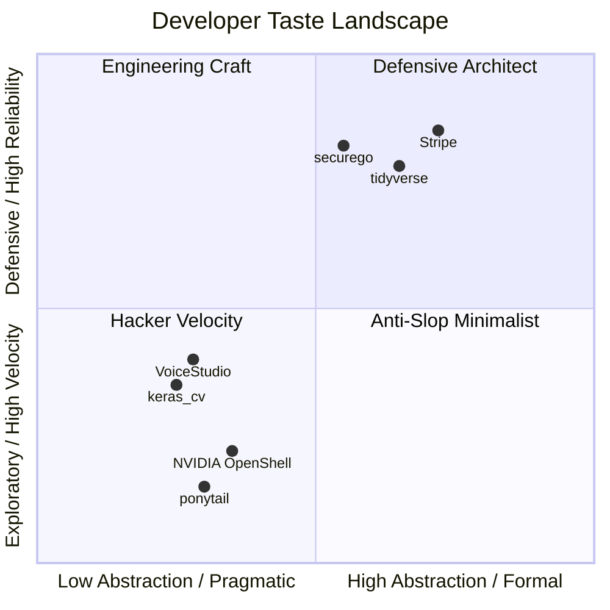

<div align="center">

# 🍷 Taste Your Taste
### *Autonomous Developer Taste Curation & Vibe Stacking Engine for AI Agents*

**CLAUDE.md • .agent • .cursorrules • AGENTS.md • Powered by LLM Reasoning**

<p align="center">
  <a href="https://github.com/joe1chief/taste-your-taste/actions/workflows/radar.yml">
    
  </a>
  <a href="https://github.com/joe1chief/taste-your-taste/actions/workflows/taste-roast.yml">
    
  </a>
  <a href="https://www.npmjs.com/package/taste-code">
    
  </a>
  <a href="https://github.com/joe1chief/taste-your-taste/stargazers">
    
  </a>
  <a href="./LICENSE">
    
  </a>
</p>

<p align="center">
  <b>"Code generation is cheap. Taste is rare."</b>
</p>

```bash
# 🧙 Interactive Setup Wizard:
npx taste-code init

# 🍸 Instant Vibe Stacking with npx:
npx taste-code blend --style antfu --tone karpathy

# 🌶️ Savage Linus Torvalds Taste Roast:
npx taste-code roast CLAUDE.md
```

</div>

---

## 📖 The Manifesto

In the pre-AI era, developers loved exploring the `.dotfiles` (`.zshrc`, `.vimrc`, `tmux.conf`) of legendary hackers to see how they tuned their tools.

In the **Vibe Coding** era, human programmers don't write every line of syntax by hand. Instead, **developer taste** is captured in the behavioral guardrails, engineering constraints, and architectural temperaments we impart to our AI agents:

* How do world-class teams prevent AI slop (verbose apologies, gratuitous mocks, boilerplate)?
* How do high-velocity solo developers force AI to produce concise, elegant diffs?
* How do infrastructure projects like NVIDIA, Stripe, and tidyverse instruct Claude Code and Cursor?

**`taste-your-taste`** is an end-to-end, LLM-first developer ecosystem:
1. 🛠️ **`taste` CLI**: A zero-dependency Lego-brick stacking tool to blend master developer tastes into your repository.
2. 🧙 **`taste init` Wizard**: Interactive 10-second TUI to configure CLAUDE.md, Cursor MDC, or Antigravity rules.
3. 🌶️ **Taste Roast Critic**: Linus Torvalds-inspired LLM critic that audits your agent instructions with brutal technical honesty.
4. 📡 **Autonomous LLM Radar**: GitHub Action engine that monitors GitHub Trending and tracks Prompt Evolution via Git Blob SHAs.
5. 🌐 **[Interactive Web Gallery](https://joe1chief.github.io/taste-your-taste)**: Real-time explorer, Taste Blender studio, and client-side roast tester.
6. 🏛️ **The Hall of Fame**: Authentic battle-tested configs harvested from top open-source projects.

---

## 🚀 `taste` CLI: Taste Stacking Engine

Copy-pasting someone else's 300-line prompt is clumsy and brittle. **`taste`** breaks master developer styles and agent tones into atomic, composable Lego bricks.

### 1. Interactive Setup Wizard (`taste init`)
Run the interactive terminal wizard to pick your target rule format, style, and tone in 10 seconds:
```bash
npx taste-code init
```

### 2. View Available Modules
```bash
npx taste-code list
```
* **Styles**: `antfu` (strict TS / modern ESM), `karpathy` (minimalist single-file ML), `stripe` (industrial craft), `minimalist` (zero-dependency), `defensive` (invariants & safety), `hacker` (high-velocity 160-char lines).
* **Tones**: `karpathy` (anti-slop diff-first), `linus` (anti-overengineering), `terse` (ultra-compact), `teacher` (edge-case pedagogy).
* **Presets**: `anti-slop`, `solo-hacker`, `enterprise`.

### 3. Stack a Single Flavor
```bash
# Stack minimalist zero-dependency rules into CLAUDE.md
npx taste-code add minimalist

# Stack Antfu TypeScript rules into Modern Cursor MDC (.cursor/rules/taste.mdc)
npx taste-code add antfu --target mdc

# Stack into legacy .cursorrules
npx taste-code add antfu --target cursor

# Stack into Google Antigravity / Gemini Agent (.agent/rules.md)
npx taste-code add hacker --target agent
```

### 4. Blend Styles & Tones (Taste Stacking)
Mix orthogonal aspects — combine **Antfu's TypeScript strictness** with **Karpathy's outcome-driven, anti-slop tone**:
```bash
npx taste-code blend --style antfu --tone karpathy
```
The CLI automatically maintains non-destructive block boundaries (`<!-- TASTE:STYLE:... -->` and `<!-- TASTE:TONE:... -->`), so you can re-run and re-stack without duplicating content or overwriting your own custom rules.

---

### 🌐 Supported Formats & Target Auto-Detection
The CLI automatically discovers and writes to the correct agent convention in your repository:
| Target Flag | Generated File | Target Agent / IDE |
| :--- | :--- | :--- |
| *(default)* | `CLAUDE.md` | Claude Code (Root) |
| `--target dotclaude` | `.claude/CLAUDE.md` | Claude Code (Nested) |
| `--target mdc` | `.cursor/rules/<name>.mdc` | Modern Cursor (with YAML frontmatter) |
| `--target cursor` | `.cursorrules` | Legacy Cursor |
| `--target agent` | `.agent/rules.md` | Google Antigravity / Gemini Agent |
| `--target agents` | `AGENTS.md` | Multi-Agent Specification standard |

---

## 🌶️ Taste Roast: LLM-Driven Linus Torvalds Critique

How good are your agent instructions? Are you paying Anthropic to generate verbose corporate apologies?

Run the **Taste Roast**:
```bash
npx taste-code roast [path/to/CLAUDE.md]
```

### What It Audits (Powered by LLM):
* 🧠 **LLM Semantic Evaluation**: Evaluates constraints, actionable commands, and token economics using DeepSeek / OpenAI models.
* 📉 **Fluff & Platitude Index**: Detects useless corporate clichés (*"write clean code"*, *"strive for excellence"*, *"be helpful"*).
* 💸 **Politeness Tax**: Calculates token budget wasted on polite greetings and apologies (*"please"*, *"kindly"*, *"sorry"*).
* 🛡️ **Negative Armor**: Verifies whether you gave the AI explicit boundaries (*"never"*, *"do not"*, *"prohibit"*).
* ⚙️ **Verifiable Tooling**: Checks whether the agent was given exact test/linter commands to verify its output.
* 💯 **Taste Score (0-100)**: From `CRIMINAL TOXIC WASTE` to `CHEF'S TASTE`.

### Sample Output:
```text
┌─ 🌶️ TASTE ROAST REPORT ────────────────────────────────────────────────────────────────────────┐
│ Target File: CLAUDE.md                                                                        │
│ Lines: 7  |  Tokens: ~61  |  Words: 45  |  Engine: 🧠 LLM Reasoning                            │
│                                                                                               │
│ Taste Score: 12 / 100 [███░░░░░░░░░░░░░░░░░░░░░░░░░░░]                                        │
│ Verdict:     CRIMINAL TOXIC WASTE                                                             │
│                                                                                               │
│ 🔥 Sins & Pathology Detected:                                                                 │
│   ❌ Zero specificity — 'clean code' is undefined and unmeasurable                            │
│   ❌ 'Be helpful' is a vibe, not an operational instruction                                  │
│   ❌ No output contract or verifiable testing commands                                       │
│                                                                                               │
│ 🎙️ Linus Torvalds Roasts Your Taste:                                                         │
│   "This isn't a code review, it's a fortune cookie. 'Write clean code' is what every         │
│    professor says before assigning homework they won't grade."                                │
│   "If I followed these rules, I'd write code that's helpful and apologize when I'm wrong.     │
│    Congratulations, you've described a well-adjusted intern."                                 │
│                                                                                               │
│ 💊 Remedy & Prescription:                                                                     │
│   Run npx taste-code blend --style minimalist --tone terse to replace fluff with discipline. │
└───────────────────────────────────────────────────────────────────────────────────────────────┘
```

---

## 📡 The Autonomous LLM Radar

Powered by **GitHub Actions** and [`scripts/radar.py`](./scripts/radar.py), this repository monitors trending open-source projects daily using large language models instead of rigid regex heuristics:


* **LLM Intelligence**: Uses OpenAI-compatible endpoints (DeepSeek, Qwen, or OpenAI) to analyze instruction files, identify taste archetypes, and extract verbatim prompt gems.
* **Strict Quality Gate**: Only captures repositories that are **either on GitHub Trending** (Daily/Weekly) or **have ⭐️ 1,000+ Stars** (rejecting personal/low-impact repos).
* **⚡ Prompt Evolution Tracking**: Stores Git Blob SHAs to detect when authors iterate or revise their prompts. When a change is pushed upstream, Radar triggers LLM prompt diff analysis and opens an evolution report issue!
* **🚀 Automated PR Staging (`--create-pr`)**: Optionally creates git branches and automated Pull Requests to stage newly discovered tastes straight into the repository.
* **Zero spam**: History is tracked in `data/seen_repos.json` to prevent duplicates.
* **Mobile Alerts**: GitHub issues are created automatically with preview snippets and maintainer checklists.

---

## 🏛️ The Hall of Fame

Curated directly from authentic production repositories:

| Project | Stars | Language | File | Taste Archetype | Key Highlight |
| :--- | :---: | :---: | :---: | :---: | :--- |
| [**openclaw / openclaw**](tastes/ai-infra/openclaw) | ⭐️ 390.8k | Rust / C | `AGENTS.md` | Defensive Architect | One owner per responsibility, proof scoped, and no blind retries. |
| [**DietrichGebert / ponytail**](discovered/DietrichGebert__ponytail) | ⭐️ 148.7k | JavaScript | `AGENTS.md` | Engineering Craft | "Lazy senior dev mode: the best code is the code you never wrote." |
| [**VoiceStudio**](discovered/debpalash__VoiceStudio) | ⭐️ 49.8k | Python / TS | `AGENTS.md` | Hacker Velocity | Explicit token economy; default to shortest response; status updates 1 line max. |
| [**mksglu / context-mode**](discovered/mksglu__context-mode) | ⭐️ 24.3k | TypeScript | `CLAUDE.md` | Engineering Craft | Mandatory routing rules to protect context window from flooding. |
| [**NVIDIA / OpenShell**](tastes/ai-infra/nvidia-openshell) | ⭐️ 11.6k | Rust | `AGENTS.md` | Anti-Slop Minimalist | Injected into context on every interaction; forbids unnecessary restructuring. |
| [**securego / gosec**](tastes/security/securego-gosec) | ⭐️ 5.4k | Go | `CLAUDE.md` | Defensive Architect | AST walking rules, rule ID stability, and deterministic test invocation. |
| [**keras_cv_attention_models**](tastes/machine-learning/keras-cv-attention-models) | ⭐️ 1.7k | Python | `.agent/rules.md` | Hacker Velocity | `black -l 160`, single-line multi-assignments, thin wrapper pattern. |
| [**tidyverse / readr**](tastes/data-science/tidyverse-readr) | ⭐️ 1.1k | R / C++ | `.claude/CLAUDE.md` | Defensive Architect | Clean boundary between Edition 2 (lazy parsing) and Edition 1 (eager C++ parser). |
| [**Stripe / stripe-java**](tastes/fintech/stripe-java) | ⭐️ 600 | Java | `.claude/CLAUDE.md` | Engineering Craft | Exact `just` test runners, Spotless formatting commands, and HTTP abstraction map. |

---

## 🎭 The 4 Vibe Archetypes



---

## ⚡ The Anti-Slop Commandments (Real-world Gems)

> **On Apologies & Conversational Fluff:**
> *"Never say 'Certainly!', 'I'd be glad to help', or apologize. Answer immediately with the precise solution or git patch."*

> **On Dependency Bloat:**
> *"Do not install or import a third-party package if the behavior can be implemented cleanly in under 20 lines of native standard library code."*

> **On Scope Creep & Refactoring:**
> *"Do not refactor code outside the immediate scope of the requested change without explicit advance permission. No opportunistic cleanup."*

> **On Test Integrity:**
> *"Do not write tautological mock tests that only assert mocks return mocks. Tests must exercise real logic against real data structures."*

---

## ⚙️ Environment Configuration

Both the **`taste` CLI** and **Radar Engine** natively leverage OpenAI-compatible LLM endpoints:

```bash
# Optional: Set your preferred LLM provider (defaults to OpenAI compatible)
export OPENAI_API_KEY="your-api-key"
export OPENAI_BASE_URL="https://token-api.yicloud.com/v1"   # Or https://api.openai.com/v1
export LLM_MODEL="DeepSeek-V4.1-Flash"                     # Or gpt-4o-mini
```

If no API key is set, the CLI automatically falls back to an offline deterministic engine without breaking.

---

## 🤝 Contributing

1. **Submit via Issue**: Click [**✨ Submit a Developer Taste**](https://github.com/joe1chief/taste-your-taste/issues/new?template=taste_submission.yml).
2. **Submit a Taste Lego Brick**: Add a new style or tone to `registry/styles/` or `registry/tones/` and submit a Pull Request!

---

## 📄 License

Distributed under the [MIT License](./LICENSE). All curated taste files remain the copyright of their respective authors under their original open-source licenses.
