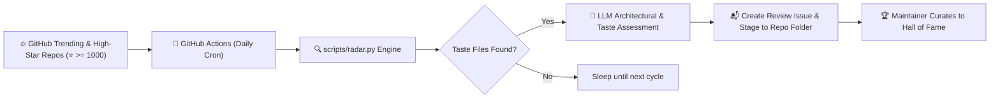

<div align="center">

# 🍷 Taste Your Taste
### *Autonomous Developer Taste Curation & Vibe Stacking Engine for AI Agents*

**CLAUDE.md • .cursorrules • .cursor/rules/*.mdc • AGENTS.md • .agent/rules.md**

<p align="center">
  <a href="https://github.com/joe1chief/taste-your-taste/actions/workflows/radar.yml">
    
  </a>
  <a href="https://github.com/joe1chief/taste-your-taste/actions/workflows/taste-roast.yml">
    
  </a>
  <a href="https://www.npmjs.com/package/taste-code">
    
  </a>
  <a href="https://github.com/joe1chief/taste-your-taste/stargazers">
    
  </a>
  <a href="./LICENSE">
    
  </a>
</p>

<p align="center">
  <b>"Code generation is cheap. Taste is rare."</b>
</p>

<p align="center">
  
  <br><br>
  
</p>

```bash
# 🧙 Interactive 10-Second Setup Wizard:
npx taste-code init

# 🍸 Instant Vibe Stacking (Lego Bricks):
npx taste-code blend --style antfu --tone karpathy

# 💧 Token Compactor & De-slop Optimizer (Save 30-70% Context Tokens):
npx taste-code prune CLAUDE.md --write

# ⚖️ Engineering Philosophy Comparator (Antfu vs Karpathy):
npx taste-code diff antfu karpathy

# 🌶️ Savage Linus Torvalds Taste Roast Critic:
npx taste-code roast CLAUDE.md

# 🪪 Dynamic GitHub Profile Taste HUD Card Generator:
npx taste-code card --user yourname --theme cyber --output taste-card.svg

# 🛡️ Sleek Vector Micro-Badge Generator (Shields style):
npx taste-code badge --type score --output taste-badge.svg
```

</div>

---

## 📖 The Manifesto

In the pre-AI era, developers loved exploring the `.dotfiles` (`.zshrc`, `.vimrc`, `tmux.conf`) of legendary hackers to see how they tuned their tools.

In the **Vibe Coding** era, human programmers don't write every line of syntax by hand. Instead, **developer taste** is captured in the behavioral guardrails, engineering constraints, and architectural temperaments we impart to our AI agents:

* How do world-class teams prevent AI slop (verbose apologies, gratuitous mocks, boilerplate)?
* How do high-velocity solo developers force AI to produce concise, elegant diffs?
* How do infrastructure projects like NVIDIA, Stripe, and tidyverse instruct Claude Code and Cursor?

**`taste-your-taste`** is an end-to-end, LLM-first developer ecosystem:
1. 🛠️ **`taste` CLI**: A zero-dependency Lego-brick stacking tool to blend master developer tastes into your repository.
2. 🧙 **`taste init` Wizard**: Interactive 10-second TUI to configure CLAUDE.md, Cursor MDC, or Antigravity rules.
3. 💧 **`taste prune` (De-slop Compactor)**: Strips out polite conversational filler and tautological fluff while preserving 100% of technical rules, reducing context window tax by 30-70%.
4. ⚖️ **`taste diff` (Philosophy Comparator)**: Side-by-side comparative analysis contrasting conflicting engineering temperaments (e.g., Antfu vs Karpathy).
5. 🌶️ **Taste Roast Critic**: Linus Torvalds-inspired LLM critic that audits your agent instructions with brutal technical honesty.
6. 🪪 **`taste card` & `taste badge`**: Generates aesthetic cyberpunk HUD profile cards (495x195) and sleek vector micro-badges (28px pill) with custom themes and radial gauges.
7. 🏛️ **Top-Level Open-Source Directories**: Authentic, battle-tested configs from 26+ star projects organized directly as first-level directories.
8. 🧠 **Curated Agent Skills Library ([`skills/`](./skills))**: Modular SKILL.md playbooks (Andrej Karpathy guidelines, offensive AI security, de-AI writing, design tokens, etc.).
9. 📡 **Autonomous LLM Radar**: GitHub Action engine that monitors GitHub Trending and tracks Prompt Evolution via Git Blob SHAs.
10. 🌐 **[Interactive Web Gallery](https://joe1chief.github.io/taste-your-taste)**: Real-time explorer, Taste Blender, Pruner preview, and live Badge Studio.

---

## 🏛️ Repository Architecture

All star open-source project configs and modular skill playbooks are structured directly as top-level directories:

```
taste-your-taste/
├── 📋 Agent Directives & Specifications
│   ├── AGENTS.md                  # Autonomous agent operating directives & constraints
│   └── CLAUDE.md                  # Claude Code repository conventions & style guidelines
├── 🛠️ Core Engines & CLI
│   ├── bin/taste                  # Executable CLI entrypoint
│   ├── src/                       # Zero-dependency modular engines
│   │   ├── registry.js            # Style & tone brick loader
│   │   ├── stacker.js             # Marker-based non-destructive injector
│   │   ├── pruner.js              # Token compactor & de-slop optimizer
│   │   ├── differ.js              # Philosophy & constraint comparator
│   │   ├── roaster.js             # Linus Torvalds technical audit engine
│   │   └── card.js                # GitHub profile taste badge generator
│   ├── registry/                  # Atomic Lego taste bricks (styles, tones, presets)
│   └── api/                       # Serverless SVG Profile Card Badge API (api/card.js)
├── 🧠 Curated Agent Skills Library
│   └── skills/                    # 7 modular SKILL.md behavioral playbooks
│       ├── karpathy-guidelines/   # ⭐️ 216k — Simplicity & surgical diffs
│       ├── offensive-ai-security/ # ⭐️ 7.1k — AI red-teaming & vulnerability assessment
│       ├── agentic-design/        # ⭐️ 2.9k — Frontend Generative UI & design tokens
│       ├── sepia-hemingway/       # ⭐️ 2.9k — De-AI humanized writing engine
│       ├── claude-osint/          # ⭐️ 2.7k — Open-source reconnaissance & intelligence
│       ├── markit/                # ⭐️ 1.3k — Clean LLM markdown extraction
│       └── repo-task-proof-loop/  # ⭐️ 732  — Task proof loop with autonomous exit gates
├── 🌟 Star Open-Source Projects (Top-Level Repositories)
│   ├── openclaw/                  # ⭐️ 390.8k — AI personal assistant operating system
│   ├── andrej-karpathy-skills/    # ⭐️ 216.0k — Andrej Karpathy's surgical guidelines
│   ├── ponytail/                  # ⭐️ 148.7k — Minimalist web framework
│   ├── VoiceStudio/               # ⭐️ 49.8k  — Production voice synthesis pipeline
│   ├── agentsmd/                  # ⭐️ 24.7k  — Universal agent guidelines
│   ├── open-saas/                 # ⭐️ 16.0k  — React & Node SaaS template
│   ├── cbmc/                      # ⭐️ 12.8k  — C Bounded Model Checker
│   ├── nvidia-openshell/          # ⭐️ 11.6k  — NVIDIA AI shell automation
│   ├── securego-gosec/            # ⭐️ 8.9k   — Go security AST checker
│   ├── rust-on-nails/             # ⭐️ 8.4k   — Rust full-stack production architecture
│   ├── rtags/                     # ⭐️ 7.6k   — C/C++ indexing engine
│   ├── claude-red/                # ⭐️ 7.1k   — Offensive AI red-teaming playbook
│   ├── claude-token-efficient/    # ⭐️ 6.1k   — Token-optimized Claude Code config
│   ├── devin-cursorrules/         # ⭐️ 5.9k   — Devin-styled cursor rules
│   ├── stripe-java/               # ⭐️ 4.7k   — Enterprise Java SDK by Stripe
│   ├── gravity/                   # ⭐️ 4.6k   — Antigravity agentic workflow engine
│   ├── tidyverse-readr/           # ⭐️ 3.9k   — R data ingest library
│   ├── awesome-design-skills/     # ⭐️ 2.9k   — Frontend agent design tokens
│   ├── sepia-skills/              # ⭐️ 2.9k   — Hemingway de-AI writing engine
│   ├── claude-osint/              # ⭐️ 2.7k   — Cloud OSINT & reconnaissance
│   ├── graphframes/               # ⭐️ 2.3k   — Graph processing for Apache Spark
│   ├── keras-cv-attention-models/ # ⭐️ 1.8k   — Deep learning CV architectures
│   ├── prismer/                   # ⭐️ 1.6k   — Vision-language reasoning model
│   ├── markit/                    # ⭐️ 1.3k   — Intelligent web content extractor
│   ├── browser-operator/          # ⭐️ 1.2k   — Autonomous browser automation agent
│   └── repo-task-proof-loop/      # ⭐️ 732    — Spec-driven task proof loop
└── 📡 Automation, Data & Gallery
    ├── scripts/radar.py           # Autonomous LLM Radar & PR Stager
    ├── data/seen_repos.json       # Discovery & blob hash tracking
    ├── docs/index.html            # Real-time Web Gallery & Badge Studio
    └── test/                      # Native Node.js test suites
```

---

## 🚀 Key Features

### 1. 🧙 Interactive Setup Wizard (`taste init`)
Configure your project in 10 seconds through an interactive terminal interface:
```bash
npx taste-code init
```
The wizard guides you through selecting:
* **Target Format**: `CLAUDE.md`, `.cursor/rules/*.mdc`, `.cursorrules`, `.agent/rules.md`, or `AGENTS.md`.
* **Engineering Style**: `antfu`, `karpathy`, `stripe`, `minimalist`, `defensive`, `hacker`.
* **Agent Tone**: `karpathy` (anti-slop diff-first), `linus` (anti-overengineering), `terse` (ultra-compact), `teacher` (edge-case pedagogy).

---

### 2. 🍸 Taste Stacking Engine (`taste add` & `taste blend`)
Copy-pasting someone else's 300-line prompt is clumsy and brittle. **`taste`** breaks master developer styles and agent tones into atomic, composable Lego bricks.

```bash
# View all available styles, tones, and presets
npx taste-code list

# Stack minimalist zero-dependency rules into CLAUDE.md
npx taste-code add minimalist

# Stack Antfu TypeScript rules into Modern Cursor MDC (.cursor/rules/taste.mdc)
npx taste-code add antfu --target mdc

# Blend Antfu's TypeScript strictness with Karpathy's terse, outcome-driven tone
npx taste-code blend --style antfu --tone karpathy
```

#### Non-Destructive Marker Boundaries
The CLI manages rules using non-destructive block boundaries (`<!-- TASTE:STYLE:... -->` and `<!-- TASTE:TONE:... -->`). You can re-run and re-stack at any time without duplicating content or overwriting your own custom rules.

#### Supported Rule Formats & Targets
| Target Flag | Generated File | Target Agent / IDE |
| :--- | :--- | :--- |
| *(default)* | `CLAUDE.md` | Claude Code (Root) |
| `--target dotclaude` | `.claude/CLAUDE.md` | Claude Code (Nested) |
| `--target mdc` | `.cursor/rules/<name>.mdc` | Modern Cursor (with YAML frontmatter) |
| `--target cursor` | `.cursorrules` | Legacy Cursor |
| `--target agent` | `.agent/rules.md` | Google Antigravity / Gemini Agent |
| `--target agents` | `AGENTS.md` | Multi-Agent Specification standard |

---

### 3. 💧 Token Compactor: `taste prune`
Agent instructions (`CLAUDE.md`, `.cursorrules`, `AGENTS.md`) are injected into the LLM context on **every single prompt or turn**. Verbose corporate platitudes, excessive politeness, and conversational slop silently inflate your API bills and dilute the model's attention.

**`taste prune`** strips conversational filler and tautological fluff while **preserving 100% of functional engineering commands, linters, and architectural invariants**:

```bash
# Preview token savings and distilled prompt
npx taste-code prune CLAUDE.md

# Prune and overwrite file in-place with automatic .bak backup
npx taste-code prune CLAUDE.md --write --backup
```

#### What It De-slops:
* 📉 **Politeness Tax**: Removes *"Please"*, *"Kindly"*, *"If you make a mistake apologize immediately"*.
* 🧽 **Tautological Fluff**: Cuts *"Always write clean, readable code and follow all best practices"*.
* 🛡️ **Zero Loss of Invariants**: Strictly preserves testing commands (`npm test`, `pytest`), linter commands (`eslint --fix`), and negative constraints (`never introduce 'any'`).
* ⚡ **Context Economy**: Reduces instruction token overhead by **30% to 70%**.

---

### 4. ⚖️ Taste Philosophy Differ: `taste diff`
Engineering cultures collide. Should an agent be an obsessive TypeScript perfectionist, or a single-file raw PyTorch hacker?

**`taste diff`** runs an architectural and philosophical contrast between two flavors or existing files:

```bash
# Compare two master archetypes
npx taste-code diff antfu karpathy

# Compare existing configs
npx taste-code diff CLAUDE.md .cursorrules
```

#### Sample Output:
```text
┌─ ⚡ TASTE PHILOSOPHY DIFF ─────────────────────────────────────────────────────────────────────────┐
│ 🥊 Comparing: antfu vs karpathy                                                               │
│                                                                                               │
│ 💥 The Philosophy Clash:                                                                      │
│   antfu demands rigorous type safety, modular packages, and modern ESM tooling.               │
│   karpathy prioritizes raw readability, single-file scripts, zero unnecessary dependencies,   │
│   and immediate algorithmic transparency over formal abstractions.                            │
│                                                                                               │
│ 🔍 Key Contrasts:                                                                             │
│   • antfu enforces strict TypeScript compilation and automated linting.                      │
│   • karpathy favors flat script simplicity and zero dependency overhead.                      │
│                                                                                               │
│ 🎯 When to choose antfu: Multi-package TS libraries, production enterprise codebases.          │
│ 🎯 When to choose karpathy: Machine learning experiments, proof-of-concepts, hackathons.      │
└───────────────────────────────────────────────────────────────────────────────────────────────┘
```

---

### 5. 🌶️ Taste Roast: LLM-Driven Linus Torvalds Critique
How good are your agent instructions? Are you paying Anthropic or OpenAI to generate verbose corporate apologies?

Run the **Taste Roast**:
```bash
npx taste-code roast [path/to/CLAUDE.md]
```

#### What It Audits (Powered by LLM):
* 🧠 **LLM Semantic Evaluation**: Evaluates constraints, actionable commands, and token economics.
* 📉 **Fluff & Platitude Index**: Detects useless corporate clichés (*"write clean code"*, *"strive for excellence"*, *"be helpful"*).
* 💸 **Politeness Tax**: Calculates token budget wasted on polite greetings and apologies (*"please"*, *"kindly"*, *"sorry"*).
* 🛡️ **Negative Armor**: Verifies whether you gave the AI explicit boundaries (*"never"*, *"do not"*, *"prohibit"*).
* ⚙️ **Verifiable Tooling**: Checks whether the agent was given exact test/linter commands to verify its output.
* 💯 **Taste Score (0-100)**: From `CRIMINAL TOXIC WASTE` to `CHEF'S TASTE`.

#### Sample Output:
```text
┌─ 🌶️ TASTE ROAST REPORT ────────────────────────────────────────────────────────────────────────┐
│ Target File: CLAUDE.md                                                                        │
│ Lines: 7  |  Tokens: ~61  |  Words: 45  |  Engine: 🧠 LLM Reasoning                            │
│                                                                                               │
│ Taste Score: 12 / 100 [███░░░░░░░░░░░░░░░░░░░░░░░░░░░]                                        │
│ Verdict:     CRIMINAL TOXIC WASTE                                                             │
│                                                                                               │
│ 🔥 Sins & Pathology Detected:                                                                 │
│   ❌ Zero specificity — 'clean code' is undefined and unmeasurable                            │
│   ❌ 'Be helpful' is a vibe, not an operational instruction                                  │
│   ❌ No output contract or verifiable testing commands                                       │
│                                                                                               │
│ 🎙️ Linus Torvalds Roasts Your Taste:                                                         │
│   "This isn't a code review, it's a fortune cookie. 'Write clean code' is what every         │
│    professor says before assigning homework they won't grade."                                │
│                                                                                               │
│ 💊 Remedy & Prescription:                                                                     │
│   Run npx taste-code blend --style minimalist --tone terse to replace fluff with discipline. │
└───────────────────────────────────────────────────────────────────────────────────────────────┘
```

---

### 6. 🪪 Dynamic Profile Taste HUD Card & Micro-Badge: `taste card` & `taste badge`
Showcase your developer taste DNA directly on your GitHub Profile README, project documentation, or website with dynamic, dark-mode SVG HUD vector cards and sleek micro-badges.

#### 1. Cyberpunk Profile HUD Card (495x195)
Features a frosted dark canvas, circular neon radial score gauge, AI Verified live pulse beacon, technical blueprint grid, and multi-theme colorways (`cyber`, `matrix`, `midnight`, `sunset`, `noir`):

```bash
# Generate local taste-card.svg with default Cyberpunk Rose theme
npx taste-code card --user yourname --theme cyber --output taste-card.svg

# Generate with Matrix Emerald hacker theme
npx taste-code card --user yourname --theme matrix --output taste-card.svg
```

#### 2. Sleek Vector Micro-Badge (28px Pill)
For repository headers, status badges, and minimal profile headers:
```bash
# Generate Taste Score Badge ([ 🍷 TASTE | 94/100 · Chef's Taste ])
npx taste-code badge --type score --output taste-badge.svg

# Generate Taste DNA Badge ([ 🍷 TASTE DNA | antfu + karpathy ])
npx taste-code badge --type dna --output taste-badge.svg

# Generate Archetype Badge ([ 🛡️ ARCHETYPE | Defensive Architect ])
npx taste-code badge --type archetype --output taste-badge.svg
```

#### 3. Live Dynamic Serverless HTTP API
Embed real-time SVG cards and badges directly using the serverless API:
```markdown
<!-- Full HUD Profile Card -->
[](https://github.com/joe1chief/taste-your-taste)

<!-- Vector Micro-Badge -->
[](https://github.com/joe1chief/taste-your-taste)
```

#### Card & Badge API Query Parameters:
| Parameter | Default | Description |
| :--- | :--- | :--- |
| `user` | `developer` | GitHub username displayed on card |
| `style` | `antfu` | Active developer style module |
| `tone` | `karpathy` | Active persona / agent tone |
| `archetype` | `Anti-Slop Minimalist` | Architectural archetype (Defensive Architect, Hacker Velocity, etc.) |
| `score` | `94` | Taste score (0 - 100) |
| `theme` | `cyber` | HUD colorway: `cyber`, `matrix`, `midnight`, `sunset`, `noir` |
| `type` | `card` | Display format: `card` (495x195 HUD) or `badge` (28px pill) |
| `badgeType`| `score` | Micro-badge type: `score`, `dna`, `archetype`, `slop`, `roast` |

---

## 🏛️ Star Open-Source Projects (Top-Level Directories)

Each open-source project is directly accessible as a first-level directory in the repository:

| Project Directory | Source Repository | Stars | Language | Taste Archetype | Key Philosophy & Invariants |
| :--- | :--- | :---: | :---: | :---: | :--- |
| [📁 `openclaw/`](./openclaw) | [openclaw/openclaw](https://github.com/openclaw/openclaw) | ⭐️ 390.8k | Rust / C | **Defensive Architect** | One owner per responsibility, proof scoped, and zero blind retries. |
| [📁 `andrej-karpathy-skills/`](./andrej-karpathy-skills) | [andrej-karpathy-skills](https://github.com/multica-ai/andrej-karpathy-skills) | ⭐️ 216.0k | Python | **Anti-Slop Minimalist** | Karpathy workflow: single-file scripts, stdlib-first, zero dependency bloat, runnable code. |
| [📁 `ponytail/`](./ponytail) | [DietrichGebert/ponytail](https://github.com/DietrichGebert/ponytail) | ⭐️ 148.7k | JavaScript | **Engineering Craft** | "Lazy senior dev mode: the best code is the code you never wrote." Minimal abstractions. |
| [📁 `VoiceStudio/`](./VoiceStudio) | [debpalash/VoiceStudio](https://github.com/debpalash/VoiceStudio) | ⭐️ 49.8k | Python / Electron | **Anti-Slop Minimalist** | Strict token economy: 1-line status updates max, electron desktop only, direct git diffs. |
| [📁 `agentsmd/`](./agentsmd) | [agentsmd/agents.md](https://github.com/agentsmd/agents.md) | ⭐️ 24.7k | Specification | **Pragmatic Taste** | The open standard specification for guiding coding agents with explicit build & test contracts. |
| [📁 `open-saas/`](./open-saas) | [wasp-lang/open-saas](https://github.com/wasp-lang/open-saas) | ⭐️ 16.0k | TypeScript / React | **Engineering Craft** | Modern full-stack SaaS boilerplate; strict package boundaries; production-ready TypeScript. |
| [📁 `nvidia-openshell/`](./nvidia-openshell) | [NVIDIA/OpenShell](https://github.com/NVIDIA/OpenShell) | ⭐️ 11.6k | Rust | **Anti-Slop Minimalist** | Injected on every prompt; strictly prohibits unsolicited restructuring or stylistic churn. |
| [📁 `securego-gosec/`](./securego-gosec) | [securego/gosec](https://github.com/securego/gosec) | ⭐️ 8.9k | Go | **Defensive Architect** | AST walking invariants, rule ID stability, and deterministic test invocation. |
| [📁 `claude-token-efficient/`](./claude-token-efficient) | [claude-token-efficient](https://github.com/drona23/claude-token-efficient) | ⭐️ 6.1k | Markdown | **Anti-Slop Minimalist** | Extreme token reduction; eliminates all conversational preamble; pure diff responses. |
| [📁 `devin-cursorrules/`](./devin-cursorrules) | [grapeot/devin.cursorrules](https://github.com/grapeot/devin.cursorrules) | ⭐️ 5.9k | Rules | **Hacker Velocity** | Autonomous self-debugging loops, automated verification, diff-first execution. |
| [📁 `gravity/`](./gravity) | [marcobambini/gravity](https://github.com/marcobambini/gravity) | ⭐️ 4.6k | C | **Defensive Architect** | Memory safety invariants in C, zero memory leak tolerance, strict Valgrind testing. |
| [📁 `rtags/`](./rtags) | [Andersbakken/rtags](https://github.com/Andersbakken/rtags) | ⭐️ 1.8k | C / C++ | **Defensive Architect** | Notes for future LLM sessions: persistent symbol database, client/server protocol, zero regression. |
| [📁 `keras-cv-attention-models/`](./keras-cv-attention-models) | [keras_cv_attention_models](https://github.com/leondgarse/keras_cv_attention_models) | ⭐️ 1.7k | Python | **Hacker Velocity** | `black -l 160`, single-line multi-assignments, compact procedural clarity, thin wrapper pattern. |
| [📁 `graphframes/`](./graphframes) | [graphframes/graphframes](https://github.com/graphframes/graphframes) | ⭐️ 1.2k | Scala / Java | **Engineering Craft** | Mission-critical Apache Spark codebase rules: strict backward compatibility, zero regressions. |
| [📁 `cbmc/`](./cbmc) | [diffblue/cbmc](https://github.com/diffblue/cbmc) | ⭐️ 1.1k | C / C++ | **Defensive Architect** | 28k-char comprehensive AI coding assistant guide: SAT/SMT verification invariants, GOTO pipeline. |
| [📁 `tidyverse-readr/`](./tidyverse-readr) | [tidyverse/readr](https://github.com/tidyverse/readr) | ⭐️ 1.1k | R / C++ | **Defensive Architect** | Boundary between Edition 2 (lazy parsing) and Edition 1 (eager C++ parser). |
| [📁 `claude-red/`](./claude-red) | [SnailSploit/Claude-Red](https://github.com/SnailSploit/Claude-Red) | ⭐️ 7.1k | Security / Shell | **Defensive Architect** | Offensive AI red-teaming skills: API security abuse, secret leak audits, exploit simulation. |
| [📁 `awesome-design-skills/`](./awesome-design-skills) | [awesome-design-skills](https://github.com/bergside/awesome-design-skills) | ⭐️ 2.9k | Design / Tokens | **Engineering Craft** | Agentic UI design skills, design system tokens, typography scales, layout guardrails. |
| [📁 `sepia-skills/`](./sepia-skills) | [Nanako0129/sepia](https://github.com/Nanako0129/sepia) | ⭐️ 2.9k | Writing / Rules | **Anti-Slop Minimalist** | De-AI Hemingway writing skill: strips corporate synthetic filler and platitudes from agent output. |
| [📁 `claude-osint/`](./claude-osint) | [elementalsouls/Claude-OSINT](https://github.com/elementalsouls/Claude-OSINT) | ⭐️ 2.7k | Shell / Python | **Hacker Velocity** | Autonomous open-source intelligence gathering skill, cloud footprint discovery. |
| [📁 `markit/`](./markit) | [shift-labs-ai/markit](https://github.com/shift-labs-ai/markit) | ⭐️ 1.3k | TypeScript / MD | **Engineering Craft** | Document to markdown converter skill: transforms complex PDFs and HTML into clean LLM context. |
| [📁 `repo-task-proof-loop/`](./repo-task-proof-loop) | [repo-task-proof-loop](https://github.com/DenisSergeevitch/repo-task-proof-loop) | ⭐️ 732 | Specification | **Defensive Architect** | Spec-driven task proof loop with autonomous subagent spawning and exit verification. |
| [📁 `prismer/`](./prismer) | [Prismer-AI/Prismer](https://github.com/Prismer-AI/Prismer) | ⭐️ 800+ | Python / PyTorch | **Pragmatic Taste** | Multi-modal vision-language architecture, PyTorch distributed training guardrails. |
| [📁 `stripe-java/`](./stripe-java) | [stripe/stripe-java](https://github.com/stripe/stripe-java) | ⭐️ 600+ | Java | **Engineering Craft** | Exact `just` test runners, Spotless formatting commands, and HTTP abstraction map. |
| [📁 `browser-operator/`](./browser-operator) | [browser-operator-core](https://github.com/BrowserOperator/browser-operator-core) | ⭐️ 510+ | TypeScript / Python | **Hacker Velocity** | Headless browser control invariants, DOM extraction resilience, zero flakiness. |
| [📁 `rust-on-nails/`](./rust-on-nails) | [purton-tech/rust-on-nails](https://github.com/purton-tech/rust-on-nails) | ⭐️ 444 | Rust | **Hacker Velocity** | Multi-agent separation: documentation agent, CLI agent, architecture boundary validation. |

---

## 🧠 Curated Agent Skills Library ([`skills/`](./skills))

In addition to whole-repository rules (`CLAUDE.md`, `AGENTS.md`), modern AI coding agents (Claude Code, Google Antigravity, Cursor 2.0, Codex) support specialized **Agent Skills** (`SKILL.md`) — self-contained behavioral playbooks that can be dynamically loaded into context when needed.

All modular skills are indexed in [`skills/`](./skills):

| Modular Skill | Direct Path | Source | Capability |
| :--- | :--- | :---: | :--- |
| **`karpathy-guidelines`** | [`skills/karpathy-guidelines/`](./skills/karpathy-guidelines/SKILL.md) | ⭐️ 216k | Andrej Karpathy's guidelines: simplicity first, surgical diffs, no speculative code. |
| **`offensive-ai-security`** | [`skills/offensive-ai-security/`](./skills/offensive-ai-security/SKILL.md) | ⭐️ 7.1k | Red-teaming and defensive audits: secrets scanning, attack surface analysis. |
| **`agentic-design`** | [`skills/agentic-design/`](./skills/agentic-design/SKILL.md) | ⭐️ 2.9k | Generative UI & token architectures for web applications. |
| **`sepia-hemingway`** | [`skills/sepia-hemingway/`](./skills/sepia-hemingway/SKILL.md) | ⭐️ 2.9k | De-AI humanized writing: strips apologies, corporate fluff, and synthetic sycophancy. |
| **`claude-osint`** | [`skills/claude-osint/`](./skills/claude-osint/SKILL.md) | ⭐️ 2.7k | Open-source intelligence: cloud recon, public DNS & asset mapping. |
| **`markit`** | [`skills/markit/`](./skills/markit/SKILL.md) | ⭐️ 1.3k | Turns messy HTML, PDFs, and rich media into clean LLM markdown context. |
| **`repo-task-proof-loop`** | [`skills/repo-task-proof-loop/`](./skills/repo-task-proof-loop/SKILL.md) | ⭐️ 732 | Spec-driven task proof loop with autonomous subagent spawning and exit gates. |

#### 💡 How to Load Skills into Your AI Coding Agent:
* **Claude Code**: Direct Claude to read any skill: `@skills/karpathy-guidelines/SKILL.md` or copy it into `.claude/skills/`.
* **Google Antigravity**: Place the skill in `.gemini/skills/` or reference via agent directives.
* **Cursor & Codex**: Reference `skills/<skill-name>/SKILL.md` in prompt context or `.cursorrules`.

---

## 📡 The Autonomous LLM Radar

Powered by **GitHub Actions** and [`scripts/radar.py`](./scripts/radar.py), this repository monitors trending open-source projects daily using large language models instead of rigid regex heuristics:



* **Strict Quality Gate**: Only captures repositories that are **either on GitHub Trending** (Daily/Weekly) or **have ⭐️ 1,000+ Stars** (rejecting personal/low-impact repos).
* **⚡ Prompt Evolution Tracking**: Stores Git Blob SHAs to detect when authors iterate or revise their prompts. When an author updates their rules, Radar detects the diff and triggers an evolution report issue!
* **🚀 Automated PR Staging (`--create-pr`)**: Optionally creates git branches and automated Pull Requests to stage newly discovered tastes straight into the repository.
* **Isolated Archives**: New radar imports live in `discovered/<owner>/<repo>/`, with `META.json` verifying repository ownership before every write. Upstream file paths are preserved. Existing curated top-level directories and `skills/` remain unchanged; evolution can read historical archives only when their metadata matches. The recovered `mattpocock/skills` import is in [`discovered/mattpocock/skills/`](./discovered/mattpocock/skills).
* **Regression Tests**: Run `python3 -m unittest discover -s test -p "test_*.py"` for offline radar coverage, and `npm test` for the CLI suite.
* **Zero Spam**: History is tracked in `data/seen_repos.json` to prevent duplicates.

---

## ⚙️ Configuration & Security

Both the **`taste` CLI** and **Radar Engine** natively leverage OpenAI-compatible LLM endpoints:

```bash
# Optional: Set your preferred LLM provider (defaults to standard OpenAI)
export OPENAI_API_KEY="your-api-key"
export OPENAI_BASE_URL="https://api.openai.com/v1"
export LLM_MODEL="gpt-4o-mini"
```

### Security & Privacy Guarantees:
* **Zero Credential Leaks**: API keys are never stored, printed, logged, or bundled.
* **Offline Deterministic Fallback**: If no API key is provided or the network is unavailable, all CLI commands (`prune`, `diff`, `roast`, `card`) fall back to deterministic local heuristic analyzers without crashing.
* **Zero Runtime Dependencies**: The entire CLI runs directly on native Node.js standard libraries.

---

## 🤝 Contributing

1. **Submit via Issue**: Click [**✨ Submit a Developer Taste**](https://github.com/joe1chief/taste-your-taste/issues/new?template=taste_submission.yml).
2. **Submit a Taste Lego Brick**: Add a new style or tone to `registry/styles/` or `registry/tones/` and submit a Pull Request!

---

## 📄 License

Distributed under the [MIT License](./LICENSE). All curated taste files and skill playbooks remain the copyright of their respective authors under their original open-source licenses.
