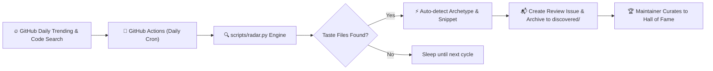
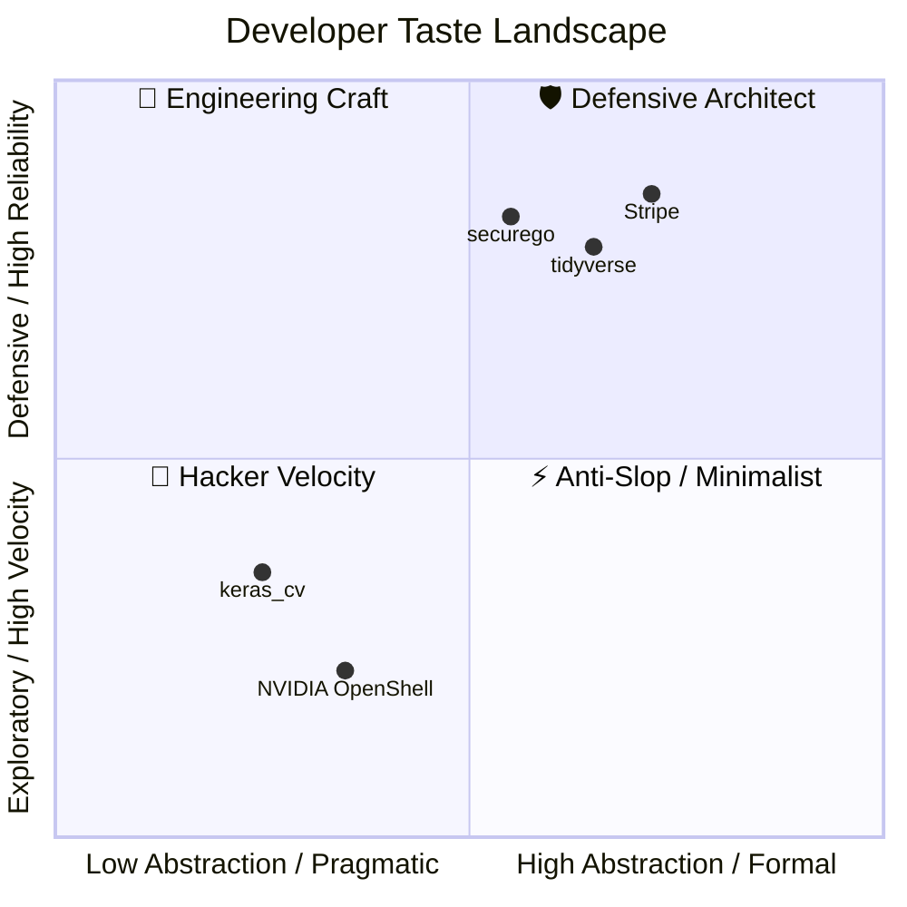

<div align="center">

# 🍷 Taste Your Taste
### *Curating Developer Taste from Top Open-Source Projects*

**CLAUDE.md • .agent • .cursorrules • AGENTS.md • The Anti-Slop Philosophy**

<p align="center">
  <a href="https://github.com/joe1chief/taste-your-taste/actions/workflows/radar.yml">
    
  </a>
  <a href="https://github.com/joe1chief/taste-your-taste/stargazers">
    
  </a>
  <a href="./LICENSE">
    
  </a>
  <a href="https://github.com/joe1chief/taste-your-taste/pulls">
    
  </a>
  <a href="./README_CN.md">
    
  </a>
</p>

<p align="center">
  <b>"Code generation is cheap. Taste is rare."</b>
</p>

</div>

---

## 📖 The Manifesto

In the pre-AI era, developers loved exploring the `.dotfiles` (`.zshrc`, `.vimrc`, `tmux.conf`) of legendary hackers to see how they shaped their terminal.

In the **Vibe Coding** era, human programmers don't write every line of syntax by hand. Instead, **developer taste** is captured in the behavioral guardrails, engineering constraints, and architectural temperaments we impart to our AI agents:

* How do world-class teams prevent AI slop (verbose apologies, gratuitous mocks, boilerplate)?
* How do high-velocity solo developers force AI to produce concise, elegant diffs?
* How do infrastructure projects like NVIDIA, Stripe, and tidyverse instruct Claude Code and Cursor?

**`taste-your-taste`** is a living museum, open archive, and automated daily radar dedicated to discovering and preserving the finest developer tastes from top open-source repositories.

---

## 📡 The Automated Radar: Self-Updating Daily

This repository never goes stale. Powered by **GitHub Actions** and the built-in **Radar Engine** (`scripts/radar.py`), it monitors trending open-source projects daily:



* **Target files monitored**: `CLAUDE.md`, `.claude/CLAUDE.md`, `.claude/rules.md`, `.agent/rules.md`, `.agent/PLANS.md`, `.cursorrules`, `.cursor/rules/`, `AGENTS.md`.
* **Zero spam**: Tracks history in `data/seen_repos.json` to prevent duplicate alerts.
* **Notification on your phone**: Automatically files a GitHub Issue whenever a high-profile repo adopts or updates its agent instructions!

---

## 🏛️ The Hall of Fame

Here are exemplary battle-tested configurations harvested directly from production open-source repositories:

| Project | Stars | Language | File | Taste Archetype | Key Highlight |
| :--- | :---: | :---: | :---: | :---: | :--- |
| [**NVIDIA / OpenShell**](tastes/ai-infra/nvidia-openshell) | ⭐️ 11.6k | Rust | `AGENTS.md` | ⚡ Anti-Slop / Minimalist | Injected into context on every interaction; forbids unnecessary restructuring. |
| [**Stripe / stripe-java**](tastes/fintech/stripe-java) | ⭐️ 600 | Java | `.claude/CLAUDE.md` | 🏢 Engineering Craft | Exact `just` test runners, Spotless formatting commands, and HTTP abstraction map. |
| [**keras_cv_attention_models**](tastes/machine-learning/keras-cv-attention-models) | ⭐️ 1.7k | Python | `.agent/rules.md` | 🤠 Hacker Velocity | `black -l 160`, single-line multi-assignments, thin wrapper pattern. |
| [**tidyverse / readr**](tastes/data-science/tidyverse-readr) | ⭐️ 1.1k | R / C++ | `.claude/CLAUDE.md` | 🛡️ Defensive Architect | Clean boundary between Edition 2 (lazy parsing) and Edition 1 (eager C++ parser). |
| [**securego / gosec**](tastes/security/securego-gosec) | ⭐️ 5.4k | Go | `CLAUDE.md` | 🛡️ Defensive Architect | AST walking rules, rule ID stability, and deterministic test invocation. |

---

## 🎭 The 4 Vibe Archetypes

Every developer has a distinct coding persona. We classify agent instructions into 4 archetypes:



### 1. ⚡ Anti-Slop / Minimalist (直击要害 / 极简主义)
* **Motto**: *"Don't apologize. Give me the diff. No unnecessary dependencies."*
* **Characteristics**: Zero conversational fluff, strictly constrained token budgets, preference for native platform primitives over heavy packages.

### 2. 🛡️ Defensive Architect (防御洁癖 / 严苛架构)
* **Motto**: *"If an invariant can break, it will break."*
* **Characteristics**: Strict type definitions, comprehensive failure modes, deterministic error handling, zero synthetic test mocks.

### 3. 🤠 Hacker Velocity (单兵作战 / 极速狂飙)
* **Motto**: *"Working software over ceremonies."*
* **Characteristics**: Single-line tuples, thin wrappers around core engines, wide line limits (`160+ chars`), ruthless velocity.

### 4. 🏢 Engineering Craft (工程规范 / 工业标准)
* **Motto**: *"Consistency is reliability."*
* **Characteristics**: Deterministic build tooling (`just`, `make`), explicit spotless/linter commands, layered architecture map.

---

## ⚡ The Anti-Slop Commandments (Real-world Gems)

Real directives spotted in the wild that keep AI agents honest and sharp:

> **On Apologies & Conversational Fluff:**
> *"Never say 'Certainly!', 'I'd be glad to help', or apologize. Answer immediately with the precise solution or git patch."*

> **On Dependency Bloat:**
> *"Do not install or import a third-party package if the behavior can be implemented cleanly in under 20 lines of native standard library code."*

> **On Scope Creep & Refactoring:**
> *"Do not refactor code outside the immediate scope of the requested change without explicit advance permission. No opportunistic cleanup."*

> **On Test Integrity:**
> *"Do not write tautological mock tests that only assert mocks return mocks. Tests must exercise real logic against real data structures."*

---

## 🛠️ How to Run the Radar Locally

Want to run the radar locally on your machine or search custom repositories?

```bash
# Clone the repository
git clone https://github.com/joe1chief/taste-your-taste.git
cd taste-your-taste

# Run dry-run scan (uses gh auth token or GITHUB_TOKEN)
python3 scripts/radar.py --dry-run --limit 5

# Scan and automatically save newly discovered taste files to discovered/
python3 scripts/radar.py --limit 5 --min-stars 100
```

### Radar CLI Options:
* `--dry-run`: Search and inspect without modifying files or opening issues.
* `--limit <N>`: Maximum new discoveries to process per run (default: `5`).
* `--min-stars <N>`: Minimum star count threshold for code search candidates (default: `50`).
* `--repo <owner/repo>`: Target repository where review issues are opened.

---

## 🤝 Contributing

Have you found an amazing `CLAUDE.md`, `.cursorrules`, or `.agent/rules.md` in a public repository?

1. **Submit via Issue**: Click [**✨ Submit a Developer Taste**](https://github.com/joe1chief/taste-your-taste/issues/new?template=taste_submission.yml) and fill in the details.
2. **Submit via Pull Request**: Add the taste file to `tastes/<category>/<repo_name>/` with a `META.json` and a summary in the table above.

---

## 📄 License

Distributed under the [MIT License](./LICENSE). All curated taste files remain the copyright of their respective authors and open-source projects under their respective open-source licenses.
