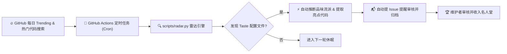

<div align="center">

# 🍷 Taste Your Taste (品味你的品味)
### *汇集顶级开源项目的开发者审美、积木混搭 CLI 与毒舌点评器*

**CLAUDE.md • .agent • .cursorrules • AGENTS.md • 反 AI 油腻哲学 (Anti-Slop)**

<p align="center">
  <a href="https://github.com/joe1chief/taste-your-taste/actions/workflows/radar.yml">
    
  </a>
  <a href="https://github.com/joe1chief/taste-your-taste/stargazers">
    
  </a>
  <a href="./LICENSE">
    
  </a>
  <a href="./README.md">
    
  </a>
</p>

<p align="center">
  <b>“代码生成变得廉价，审美与品味才是稀缺品。”</b>
</p>

```bash
# 一键混搭大师品味：
npx taste-code blend --style antfu --tone karpathy

# Linus Torvalds 风格毒舌点评你的规则：
npx taste-code roast CLAUDE.md
```

</div>

---

## 📖 项目起源与宣言

在 AI 时代之前，程序员最喜欢围观黑客大佬们的 `.dotfiles`（`.zshrc`, `.vimrc`, `tmux.conf`），看高手如何调校自己的工具库。

而在 **Vibe Coding（氛围编程）** 时代，人类程序员不再手敲每一行样板语法。**开发者的审美、品味与技术主权，集中体现在他赋予 AI Agent 的边界、脾气和工程戒律中**：

* 顶尖开源团队如何避免 AI 的“油腻感”（无意义客套、虚假单元测试、过度抽象）？
* 极速狂飙的独立黑客如何迫使 AI 直接输出短小精炼的 Git Diff？
* NVIDIA、Stripe、tidyverse 等明星项目在实际生产中是如何写 `CLAUDE.md` 与 `.agent` 的？

**`taste-your-taste`** 不仅是一个收集库，更是一个完整的工具链生态：
1. 🛠️ **`taste` CLI**：乐高积木式品味混搭命令行工具，一键向本地项目注入大师审美。
2. 🌶️ **Taste Roast（毒舌点评器）**：以 Linus 视角无情痛骂低质规则，分析上下文污染与无用客套。
3. 📡 **自动化每日雷达**：GitHub Actions 每日持续扫描热门开源项目的新增规则。
4. 🏛️ **名人堂展馆**：收录来自真实大厂与顶流黑客项目的生产配置。

---

## 🚀 `taste` CLI：品味混搭（Taste Stacking）

从别人仓库里复制粘贴 300 行臃肿规则极其繁琐。**`taste`** 把大师的规则拆分为模块化的“乐高积木”（风格 Style + 脾气 Tone）：

### 1. 查看可用品味积木
```bash
npx taste-code list
```
* **工程风格 (Styles)**：`antfu` (严苛 TypeScript/现代 ESM)、`karpathy` (极简单文件机器学习)、`stripe` (工业级严谨规范)、`minimalist` (激进零依赖)、`defensive` (防御洁癖与不变量保护)、`hacker` (160 字符单兵极速)。
* **交互脾气 (Tones)**：`karpathy` (反油腻直给 diff)、`linus` (反过度抽象毒舌极客)、`terse` (极致精简零客套)、`teacher` (启发式注重边界)。
* **完整预设 (Presets)**：`anti-slop` (反油腻全套护甲)、`solo-hacker` (单兵 MVP 极速)、`enterprise` (企业合规与确定性)。

### 2. 单独添加某一流派
```bash
# 将激进极简零依赖规则注入到 CLAUDE.md
npx taste-code add minimalist

# 将 Antfu 的 TypeScript 严苛洁癖注入到 .cursorrules
npx taste-code add antfu --target cursor

# 注入到 .agent/rules.md
npx taste-code add hacker --target agent
```

### 3. 品味混搭（Taste Blend）
正交组合不同维度的品味——比如：**Antfu 的 TypeScript 架构洁癖 + Karpathy 的反废话直出 Diff 脾气**：
```bash
npx taste-code blend --style antfu --tone karpathy
```
CLI 会自动维护边界锚点（`<!-- TASTE:STYLE:... -->`），多次混合或更新不会重复生成，也不会覆盖你自己写的个性化规则！

---

## 🌶️ Taste Roast：代码品味“毒舌点评器”

你写给 AI 的 `CLAUDE.md` 真的管用吗？还是在花钱给 Anthropic 制造废话？

运行毒舌点评：
```bash
npx taste-code roast [CLAUDE.md]
```

### 深度体检指标：
* 📉 **油腻废话指数 (Fluff Index)**：检测无意义空洞套话（“编写高质量代码”、“遵循最佳实践”、“追求卓越”）。
* 💸 **客套税 (Politeness Tax)**：统计因礼貌用语（“请”、“麻烦”、“对不起”、“抱歉”）浪费的上下文预算与 Token 费用。
* 🛡️ **否定约束硬度 (Negative Armor)**：核查是否给予 AI 明确红线（“禁止”、“严禁”、“拒绝”）。
* ⚙️ **确定性工具链 (Tooling)**：检测是否提供真实可运行的测试与格式化命令（`just`, `pytest`, `cargo`, `ruff`）。
* 💯 **品味得分 (0-100)**：从 `上下文毒药 (CRIMINAL TOXIC WASTE)` 到 `米其林级别 (CHEF'S TASTE)`。

### 痛骂输出样例：
```text
┌─ 🌶️ TASTE ROAST REPORT ────────────────────────────────────────────────────────────────────────┐
│ Target File: CLAUDE.md                                                                        │
│ Lines: 7  |  Tokens: ~61  |  Words: 45                                                        │
│                                                                                               │
│ Taste Score: 8 / 100 [██░░░░░░░░░░░░░░░░░░░░░░░░░░░░]                                         │
│ Verdict: CRIMINAL TOXIC WASTE (上下文毒药)                                                         │
│                                                                                               │
│ 🔥 Sins & Pathology Detected:                                                                 │
│   ❌ Platitude Fluff: 发现 3 处空洞套话 (write clean code, ensure high quality)                │
│   ❌ Politeness Tax: 4 个客套用语正在悄悄烧掉你的上下文预算                                    │
│   ❌ Spineless Prompt: 0 条否定性约束 (AI 会直接放飞自我重构你的架构)                          │
│                                                                                               │
│ 🎙️ Linus Torvalds 正在痛骂你的品味:                                                            │
│   “你居然在写给大模型的文件里写‘请’？你在搞维多利亚时代茶话会吗？计算机没有感情，Claude          │
│    不在乎你的礼貌。你是在自费给 Anthropic 送钱让它对你说‘非常荣幸为您服务！’”                 │
│   “对 AI 说‘写干净的代码’就像告诉水它是湿的一样。这有什么意义？你的编译器参数呢？你的行宽限制呢？  │
│    这完全是让外行假装有生产力的废话。”                                                        │
│                                                                                               │
│ 💊 药方与抢救方案:                                                                             │
│   运行 npx taste blend --style minimalist --tone terse 用硬核纪律清除所有油腻。                │
└───────────────────────────────────────────────────────────────────────────────────────────────┘
```

---

## 📡 自动化雷达：每日追踪与持续更新

本项目由 **GitHub Actions** 与内置的 **Radar 引擎**（`scripts/radar.py`）驱动，每日自动监控 GitHub Trending 与热门代码变动：



---

## 🏛️ 经典品味名人堂 (Hall of Fame)

| 项目 | Stars | 语言 | 配置文件 | 品味流派 | 核心亮点 |
| :--- | :---: | :---: | :---: | :---: | :--- |
| [**NVIDIA / OpenShell**](tastes/ai-infra/nvidia-openshell) | ⭐️ 11.6k | Rust | `AGENTS.md` | ⚡ 直击要害 / 极简主义 | 每次交互必注入上下文；明令禁止无意义的架构重构。 |
| [**VoiceStudio**](discovered/debpalash__VoiceStudio) | ⭐️ 49.8k | Python / TS | `AGENTS.md` | 🤠 单兵作战 / 极速狂飙 | 严苛 Token 经济学；状态汇报最多 1 行；默认直接输出最短答案。 |
| [**Stripe / stripe-java**](tastes/fintech/stripe-java) | ⭐️ 600 | Java | `.claude/CLAUDE.md` | 🏢 工程规范 / 工业标准 | 严谨的 `just` 单测运行指令、Spotless 格式化与清晰的 HTTP 抽象层次。 |
| [**keras_cv_attention_models**](tastes/machine-learning/keras-cv-attention-models) | ⭐️ 1.7k | Python | `.agent/rules.md` | 🤠 单兵作战 / 极速狂飙 | 允许 `160` 字符单行、推崇单行多变量赋值、主模型只写薄包装。 |
| [**tidyverse / readr**](tastes/data-science/tidyverse-readr) | ⭐️ 1.1k | R / C++ | `.claude/CLAUDE.md` | 🛡️ 防御洁癖 / 严苛架构 | 清晰划分懒解析架构（Edition 2）与 C++ 快速解析（Edition 1）的边界。 |
| [**securego / gosec**](tastes/security/securego-gosec) | ⭐️ 5.4k | Go | `CLAUDE.md` | 🛡️ 防御洁癖 / 严苛架构 | AST 遍历规范、安全规则 ID 严禁破坏、确定性单测执行。 |

---

## ⚡ 真实世界中的反油腻禁令 (Anti-Slop Commandments)

> **关于废话与客套：**
> *“严禁说‘好的！’、‘我很乐意为您服务’或进行道歉。直接输出最终解决方案或 Git 补丁代码。”*

> **关于依赖膨胀：**
> *“如果一段逻辑用原生标准库 20 行以内可以优雅实现，严禁引入任何第三方 npm/pip 包。”*

> **关于范围失控与过度重构：**
> *“未经显式许可，严禁在当前修改范围之外擅自修改或重构其他代码。拒绝投机性的代码清理。”*

> **关于单元测试假象：**
> *“严禁编写仅仅断言 Mock 返回 Mock 的无意义单元测试。所有测试必须针对真实数据结构验证核心逻辑。”*

---

## 🤝 参与贡献

1. **提交你发现的优秀开源规则**：点击 [**✨ 提交一份开发者品味**](https://github.com/joe1chief/taste-your-taste/issues/new?template=taste_submission.yml)。
2. **贡献新的积木模块**：在 `registry/styles/` 或 `registry/tones/` 下添加新的 Markdown 规则，发起 Pull Request！

---

## 📄 开源许可证

本项目基于 [MIT 许可证](./LICENSE) 开源。收录的各开源项目配置文件版权归其原作者和开源项目所有。
